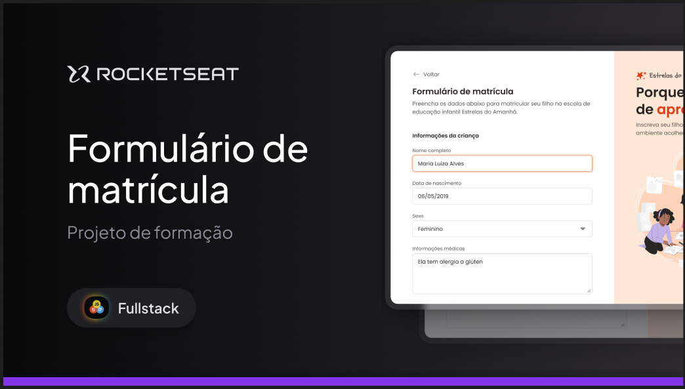
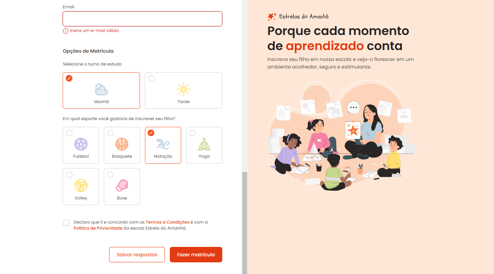

<h1 align="center">Formulário de Matrícula - Escola Estrela do Amanhã</h1>

  Projeto desenvolvido com o curso Fullstack da Rocketseat.  
  <strong>Neste projeto o objetivo principal e trabalhar os conceitos básicos de Formulários.</strong>

  <a href="#-tecnologias">Tecnologias</a>&nbsp;&nbsp;&nbsp;|&nbsp;&nbsp;&nbsp;
  <a href="#-projeto">Projeto</a>&nbsp;&nbsp;&nbsp;

 

   
  
    
 

## 🚀 Tecnologias

Esse projeto foi desenvolvido com as seguintes tecnologias:

- HTML e CSS
- Git e Github
- Figma

## 💻 Projeto

Esta página é um formulário de matrícula da escola Estrela do Amanhã.

---

Feito com ♥ by May
